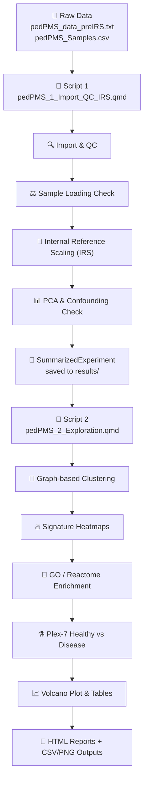

# 🧬 pedPMS Proteomics Workshop

> **Synthetic TMT proteomics dataset containing a pooled reference channel and intentional plex-level differences for demonstrating internal reference scaling (IRS).**

[](https://www.r-project.org/)
[](https://quarto.org/)
[](LICENSE)
[]()
[]()

---

## 📖 Start Here

**New to this workshop? Read [`WORKSHOP_GUIDE.md`](WORKSHOP_GUIDE.md) first.**  
It covers setup, biology, TMT concepts, step-by-step walkthroughs, expected outputs, troubleshooting, and how the synthetic dataset was built.

---

## 🎯 What You'll Learn

| Skill | What you do |
|-------|-------------|
| **Import & QC** | Load TMT intensity matrices, build sample metadata, and check data quality |
| **Batch correction** | Apply Internal Reference Scaling (IRS) to align plexes and remove batch effects |
| **Exploratory analysis** | Run PCA, cluster samples by protein profile, and identify signature proteins |
| **Pathway enrichment** | Test signature proteins for GO / Reactome pathway over-representation |
| **Confounder-aware comparison** | Run a plex-effect-free healthy-vs-disease comparison in a controlled subset |

The dataset is **fully synthetic** — no real patient, disease, or protein data — but its statistical structure (batch effects, blockwise missingness, plex-subtype confounding) is realistic, so every skill transfers directly to real experiments.

---

## 🗺️ Analysis Workflow



---

## 🚀 Quick Start

### 1. Clone the repository

```bash
git clone https://github.com/NabilAhmed9/pedPMS-proteomics-workshop.git
cd pedPMS-proteomics-workshop
```

### 2. Open the project

Open `pedPMS-proteomics-workshop.Rproj` in **RStudio**.  
This sets the working directory automatically so scripts find their inputs without any path editing.

### 3. Install dependencies

Run this once in the R console:

```r
install.packages(c("tidyverse", "readxl", "matrixStats", "cowplot", "ggExtra",
                   "ggpubr", "ggrepel", "rstatix", "DT", "conflicted",
                   "quarto", "circlize", "scales", "here"))

install.packages("BiocManager")
BiocManager::install(c("SummarizedExperiment", "pcaMethods", "limma", "bluster",
                       "igraph", "ComplexHeatmap", "clusterProfiler",
                       "org.Hs.eg.db", "ReactomePA"))
```

### 4. Render the reports (in order)

```r
quarto::quarto_render("pedPMS_1_Import_QC_IRS.qmd")   # Import, QC, IRS
quarto::quarto_render("pedPMS_2_Exploration.qmd")     # Clustering, signatures, comparison
```

Or open each `.qmd` file in RStudio and click **Render**.  
Each produces a self-contained HTML report next to the script.

> **⚠️ Script 2 depends on Script 1.** Always render `pedPMS_1_Import_QC_IRS.qmd` first.

---

## 📁 Repository Structure

```
pedPMS-proteomics-workshop/
├── pedPMS-proteomics-workshop.Rproj   # RStudio project file
├── pedPMS_1_Import_QC_IRS.qmd         # Script 1: Import, QC, IRS correction
├── pedPMS_2_Exploration.qmd           # Script 2: Clustering, signatures, plex-7 comparison
├── WORKSHOP_GUIDE.md                  # 📖 Full written guide (read this!)
├── data_raw/                          # Synthetic TMT dataset
│   ├── pedPMS_data.txt                # Plain matrix (no reference, IRS-aligned)
│   ├── pedPMS_data_preIRS.txt         # Pre-IRS matrix (batch effect present — for learning)
│   ├── pedPMS_data_postIRS.txt        # Post-IRS matrix (already aligned — for verification)
│   ├── pedPMS_Samples.csv             # TMT labelling layout
│   └── pedPMS_Protein_samples_Batch_1.csv  # Sample prep & subtype metadata
└── results/                           # Auto-created on render (not git-tracked)
    ├── tables/                        # CSV outputs (proteins, p-values, enrichment)
    └── figures/                       # PNG plots (PCA, heatmaps, volcanos)
```

---

## 🔬 Dataset at a Glance

| Property | Value |
|----------|-------|
| Protein groups | 4,893 |
| Biological samples | 66 |
| Technical re-injections | 2 per sample (R1 & R2) |
| Plexes | 7 |
| Healthy controls | 6 (all in plex 7) |
| Missing values | ~14% (blockwise, structural) |
| Reference channel | Channel 11 in every plex |

**Key analytical challenge:** Subtype and plex are strongly confounded (Cramér's V ≈ 0.7), so you cannot simply "adjust for plex." The workshop teaches how to detect and work around this.

---

## 🛠️ Switching Input Files

Script 1 adapts automatically, but you can point it at different matrices to learn or verify IRS:

```r
# In pedPMS_1_Import_QC_IRS.qmd, change this line near the top:
data_txt = "data_raw/pedPMS_data_preIRS.txt"    # Learn IRS (correction visible)
data_txt = "data_raw/pedPMS_data_postIRS.txt"   # Verify IRS (already aligned)
data_txt = "data_raw/pedPMS_data.txt"           # No reference channel (diagnostic only)
```

---

## ❓ Troubleshooting

| Symptom | Likely cause | Fix |
|---------|-------------|-----|
| `unable to find an inherited method for function 'select'` | Bioconductor masking tidyverse | Restart R (Session → Restart R) and re-run from the top |
| Garbled column names | Encoding not honoured | Keep `fileEncoding = "UTF-16LE"` in the read step |
| `file not found` at import | `here::here()` not resolving to repo root | Open `.Rproj` first, or set working directory to project root |
| No RDS found at start of Script 2 | Script 1 not run or incomplete | Render Script 1 to completion first |

See **Section 10** of [`WORKSHOP_GUIDE.md`](WORKSHOP_GUIDE.md) for more details.

---

## 📊 Outputs

Rendering both scripts produces:

| Output | Location | Description |
|--------|----------|-------------|
| HTML reports | Repo root (`*.html`) | Self-contained, reproducible reports |
| SummarizedExperiment | `results/*.rds` | Cleaned data object for downstream use |
| Tables | `results/tables/*.csv` | Signature proteins, p-values, FDR, GO enrichment, plex-7 results |
| Figures | `results/figures/*.png` | Sample-loading plots, IRS alignment, PCA, heatmaps, volcano plots |

---

## 📚 Citation

If you use this workshop or dataset in your research or teaching, please cite it as:

```bibtex
@software{pedpms_proteomics_workshop,
  author       = {Ahmed, Nabil},
  title        = {pedPMS Proteomics Workshop: A Synthetic TMT Dataset for Teaching Internal Reference Scaling and Confounder-Aware Analysis},
  year         = {2026},
  publisher    = {GitHub},
  journal      = {GitHub repository},
  howpublished = {\url{https://github.com/NabilAhmed9/pedPMS-proteomics-workshop}},
  note         = {Synthetic TMT proteomics dataset for teaching IRS, clustering, and pathway analysis.}
}
```

---

## 📄 License

- **Analysis code:** Provided for teaching purposes.
- **Dataset:** Fully synthetic. Derived from a real experiment structure, then completely anonymised with fictional names, added noise, and rescaling. No original measurement survives unchanged. See **Section 11** of [`WORKSHOP_GUIDE.md`](WORKSHOP_GUIDE.md) for the full derivation.

---

## 🙋 Questions or Issues?

Open an [issue](https://github.com/NabilAhmed9/pedPMS-proteomics-workshop/issues) on GitHub or refer to the detailed troubleshooting section in [`WORKSHOP_GUIDE.md`](WORKSHOP_GUIDE.md).
